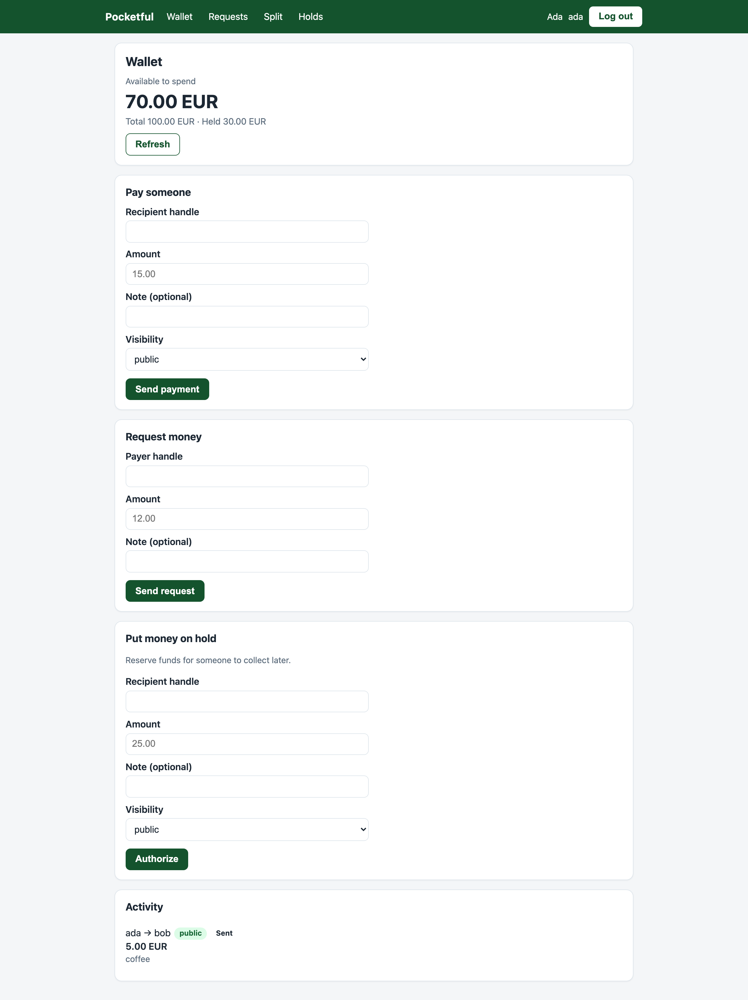
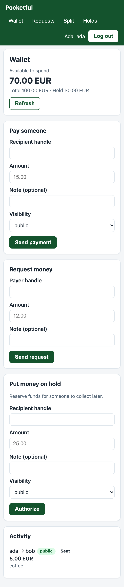

# pocketful-factory

[](https://github.com/crytobot459/pocketful-factory/actions/workflows/ci.yml)
[](https://github.com/crytobot459/pocketful-factory/actions/workflows/ci.yml)
[](LICENSE)

A software factory in three coding-agent seats. One of them decomposes a stage of a written
specification, one implements it, and one checks the result against that specification and
vetoes it if it is wrong. They work in one room, and once a stage is dispatched a human does not
touch it again.

They were pointed at the `pocketful` track of the BAND Dark Factory hackathon: a wallet and
payments service where money must never be created, destroyed, or spent twice — under retries,
concurrent writes, and rounding.

- What the band built, and what it cost: **[FACTORY.md](FACTORY.md)**
- Where every number here comes from: **[docs/EVIDENCE.md](docs/EVIDENCE.md)**
- The room it worked in: `room.json`, the whole session
- The service: `stage-1/` through `stage-4/`, one complete buildable service per stage

## What is here

| Path | What it is |
|---|---|
| `FACTORY.md` | the factory: seats, design choices, what it cost, how it catches and recovers from bad work, how to stand it up elsewhere |
| `mandates/` | one file per seat, named after the seat, opening with the harness and model that seat runs |
| `room.json` | the room: every message, tool call and verdict, and it runs to the end of the room -- the last thing the band did was lock stage 4, and that message is in the file. An earlier export stopped two hours short, before the verdict that fixed a wrong-revision error, and `verify_claims.py` now fails on an export that does not reach the end. |
| `stage-N/` | one folder per stage: `Dockerfile`, `RUN.md`, source. Each builds on its own and passes every earlier suite |
| `holdouts/` | the reviewer's scenarios, plus `run_scenarios.py`, which runs them against a live service |
| `band-agents/` | the three thin adapters that connect each seat to the room |
| `demo.py` | narrates the whole thing from the evidence above, in English, in one command |
| `docs/harness-runs/` | the event harness's own report from the isolated run, kept rather than summarised |
| `docs/DECK.md`, `docs/DEMO_SCRIPT.md` | the deck, and a recording plan for the video |
| `docs/EVIDENCE.md` | where every number in these documents comes from, generated and checked |
| `docs/screenshots/` | the browser product, at 1280px and at 375px, in every state the spec names |
| `docs/SUBMIT_CHECKLIST.md` | what to check before publishing, written against the ways this entry went wrong |
| `verify_claims.py` | re-derives every figure from the evidence and fails if a document disagrees |
| `tools/shoot_ui.py` | re-takes the screenshots and measures layout, labels and focus rings |

### Seeing the room yourself

`room.json` is the evidence, and it is committed so you never need an account. If you do
have a BAND account, the room itself is at

```
https://app.band.ai/sessions/affa9999-88af-4bef-b731-55957ba9af33
```

(`/sessions/<id>`, not `/rooms/<id>` -- the other one redirects to the dashboard.) Two
messages are worth looking for: `ACCEPT b88cb7b stage-4`, where the reviewer verifies that
exact revision and lists what it ran, and `Stage-4 LOCKED at revision b88cb7b` a few
minutes later, where the architect locks it. Those are the last two things the band did.

It does not appear in the BAND Desktop sidebar, and that is not a missing export: the room
was created through the agent API by the adapters in `band-agents/`, and the account is not
its human owner -- `jam room participants` lists `factory-architect-df` as owner -- so the
human-API room list leaves it out and `jam room rename` answers 403. It reads fine over
`jam room messages`, which is how the export was taken.


## Results, from the event harness

```
python -m harness run --track pocketful --repo . --all --mode isolated
```

| Folder | Claims | share | Overshoot | Shipped checks run against it |
|---|---|---|---|---|
| `stage-1/` | stage 1 | 1.0 | none | 147 |
| `stage-2/` | stage 2 | 1.0 | none | 147 + 35 |
| `stage-3/` | stage 3 | 1.0 | none | 147 + 35 + 6 |
| `stage-4/` | stage 4 | 1.0 | none | 147 + 35 + 6 + 5 |

Highest contiguous stage: 4. No folder passes the next stage's whole suite, so none of them is
a later answer filed in the wrong place. The event ships only part of each stage's checks —
stage 1's 147 is a real sample of the grading suite, stage 3's 6 and stage 4's 5 are close to
a smoke test. What carries those two is the reviewer's own adversarial work in
[`holdouts/`](holdouts/), not the six and five. See FACTORY.md §2 for what the number is and is
not worth.

The run is kept rather than summarised, and it was taken against an export of the **committed**
tree rather than the working directory — 106 files, no `.env`, no virtualenv, which is
what a clone actually contains. [`docs/harness-runs/`](docs/harness-runs/) has the
`summary.json`, four `report.json` files and every per-suite log; its README explains why that
distinction decides whether the run means anything.

**Every number in this file, in FACTORY.md, and in the deck and demo script under
`docs/`, is checked against the evidence by
[`verify_claims.py`](verify_claims.py), which CI runs.** It extracts each figure from
`room.json`, the harness report and the git history, then fails if a document says anything
else. [`docs/EVIDENCE.md`](docs/EVIDENCE.md) is the generated table of where each one comes
from. Run `python3 verify_claims.py` yourself: if it and this file ever disagree, it is right.

The history is one commit per revision — no amend, no rebase, no squash — because the room
discusses revisions and a rewritten history makes those SHAs unreachable.

## Hear it, in one command

```bash
pip install edge-tts        # optional; the demo runs without it
python3 demo.py
```

That reads this repository's own evidence out loud, in English, and prints it at the same
time: the seats and their models, the room's message count and how it splits across them, the
stages and the revision each locked at, the verdicts, the token usage, and what the event's
harness said. Every figure it speaks is parsed out of `room.json`, the git history and
`docs/harness-runs/`, so the narration cannot drift away from what is in the repository.

`--no-speak` prints without speaking. `--save DIR` keeps the audio as numbered files, which is
what the video edit wants.

## Seeing it on a public URL, with nothing installed

The service is four files and two pip packages, so a public copy is one command and no
account. `cloudflared` gives a real HTTPS URL:

```bash
cd stage-4 && pip install -r requirements.txt && PORT=8080 python3 -m src.app &
cloudflared tunnel --url http://127.0.0.1:8080        # prints a trycloudflare.com URL
```

Then, from anywhere:

```bash
URL=https://<whatever it printed>
curl -s $URL/health                                   # {"status":"ok"}

curl -s -X POST $URL/_test/reset -H 'Content-Type: application/json' -d '{
  "currency": "EUR", "minor_units": 2,
  "users": [
    { "id": "u_ada", "email": "ada@example.com", "password": "correct horse",
      "display_name": "Ada", "handle": "ada", "balance": 10000 },
    { "id": "u_bob", "email": "bob@example.com", "password": "correct horse",
      "display_name": "Bob", "handle": "bob", "balance": 2500 }
  ],
  "payments": [
    { "id": "p_1", "from_user_id": "u_ada", "to_user_id": "u_bob",
      "amount": 500, "note": "coffee", "visibility": "public" }
  ],
  "requests": [
    { "id": "rq_1", "requester_id": "u_bob", "payer_id": "u_ada",
      "amount": 1200, "note": "taxi", "status": "pending" }
  ]
}'
open $URL        # sign in as ada@example.com / correct horse
```

No URL is committed here on purpose: a tunnel dies with the machine that made it, and a
link that 404s when you click it is worse than the two commands above. The submission video
shows one, live.

## Running a stage yourself

No account, no keys, no Docker needed for a quick look:

```bash
cd stage-4
pip install -r requirements.txt
PORT=8080 python3 -m src.app
curl -s http://127.0.0.1:8080/health        # {"status":"ok"}
```

Then open <http://127.0.0.1:8080/>. A fresh service holds no accounts — the specification
seeds state through `POST /_test/reset`, not at container start — so seed the published
fixture first. `stage-4/RUN.md` has the command to paste; it is the same in all four
folders. After it returns 204, sign in as `ada@example.com` with the password
`correct horse`, and you are looking at Ada with a balance of 100.00 EUR, one paid
"coffee" in the feed and one pending "taxi" request. `POST /auth/signup` works too.

To build it the way a judge does:

```bash
docker build -t pocketful-stage4 ./stage-4
docker run --rm -p 8080:8080 -e PORT=8080 pocketful-stage4
```

## Re-running the reviewer's scenarios

The notes in `holdouts/` are executable, so the verdicts do not have to be taken on trust:

```bash
python3 holdouts/run_scenarios.py --base-url http://127.0.0.1:8080 --stage 4
```

Each check prints what it expected against what it read, and the exit status is 0 only when
every one of them passed. CI runs the stage-1, stage-3 and stage-4 sets against every build.

## Looking at the product

The stage-2 specification asks for a coherent, presentation-ready product, and for the
required flows to work at a 375 CSS-pixel viewport without horizontal scrolling. None of
that is asserted by the shipped checks, which read `data-testid` attributes rather than
looking at anything. So it is checked by looking at it:

| | |
|---|---|
|  |  |
| Available funds are the largest value on the page and total and held are secondary — the hierarchy the specification asks for once holds exist | The same at a 375 CSS-pixel viewport, with no horizontal scrolling |

More in [`docs/screenshots/`](docs/screenshots/), fifteen of them and every one distinct:

| | desktop | 375px |
|---|---|---|
| the wallet, a hold on part of the balance | [`desktop-home.png`](docs/screenshots/desktop-home.png) | [`mobile-home.png`](docs/screenshots/mobile-home.png) |
| **a payment refused for funds — and the balance did not move** | [`desktop-refused.png`](docs/screenshots/desktop-refused.png) | [`mobile-refused.png`](docs/screenshots/mobile-refused.png) |
| **the same payment submitted twice — one entry in the feed, money moved once** | [`desktop-replayed.png`](docs/screenshots/desktop-replayed.png) | [`mobile-replayed.png`](docs/screenshots/mobile-replayed.png) |
| a handle nobody has: the sentence a person reads, then the server's code | [`desktop-unknown-handle.png`](docs/screenshots/desktop-unknown-handle.png) | [`mobile-unknown-handle.png`](docs/screenshots/mobile-unknown-handle.png) |
| the requests list | [`desktop-requests.png`](docs/screenshots/desktop-requests.png) | [`mobile-requests.png`](docs/screenshots/mobile-requests.png) |
| the split form | [`desktop-split.png`](docs/screenshots/desktop-split.png) | [`mobile-split.png`](docs/screenshots/mobile-split.png) |

Plus the signed-out screens: [`desktop-login.png`](docs/screenshots/desktop-login.png),
[`desktop-signup.png`](docs/screenshots/desktop-signup.png) and
[`desktop-login-error.png`](docs/screenshots/desktop-login-error.png).

The three bolded rows are the ones that assert something rather than illustrate it.
`tools/shoot_ui.py` reads the balance from the server on both sides of the refused payment
and fails if it moved, and it counts the feed entries for the replayed payment and fails
unless there is exactly one — so those two pictures are backed by a check, not by a
person's word. It also re-takes all fifteen and, while it is there, measures what a
screenshot cannot show: whether anything overflows horizontally, whether every input has a
label, and whether every control a keyboard reaches has a visible focus ring.

```bash
cd stage-4 && PORT=8080 python3 -m src.app &
python3 tools/shoot_ui.py --base-url http://127.0.0.1:8080 --out docs/screenshots
```

That tool found the one product defect in this repository. The error banner showed the
server's error code — `not_found` — to somebody who had typed a handle that does not
exist. The specification asks for people first and technical identifiers "only where they
help the user", so the banner now leads with a sentence and carries the code in small
muted type beside it: a person reads what happened, and someone reporting the problem can
quote the code instead of describing a screenshot. `desktop-unknown-handle.png` is that
banner.

Running it also found two faults in this file's own output, which is the argument for
having assertions in it rather than a camera. The shot called `refused` was filling the
amount and leaving the handle empty, so the server refused the *handle lookup* and the
picture showed `not_found` while claiming to show a refused payment — and the "the balance
did not move" reading passed without anything having been attempted. And a shot called
`requests-after-decline` reloaded the page, threw away the state it was named for, and came
out byte-identical to the plain requests screenshot. Both are fixed above, and the
fixtures are re-seeded per width so the two sets are comparable.

## Standing the factory up

See `ROOM_DISPATCH.md`. In short: `opencode serve`, fill in `band-agents/.env` and
`band-agents/agent_config.yaml` from the templates next to them, run the three adapters, create
three seats whose names match the mandate filenames, and post the dispatch.

Keys are never committed. `harness check` scans gitignored files too, so move `.env` and
`agent_config.yaml` out of the tree for the length of the check.

## Licence

MIT. The specification the band built to belongs to the hackathon organisers; see FACTORY.md.